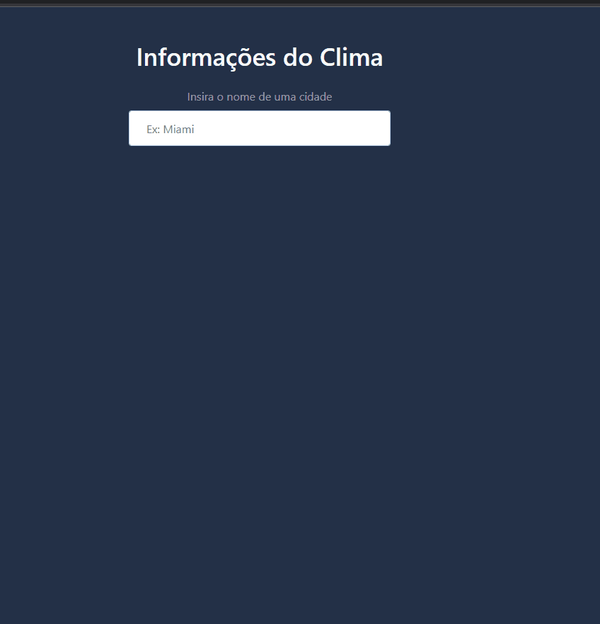

# Projeto Weather App 🌦⛈🌤☀😎

Página que informa a temperatua, o clima, e se é dia ou noite na cidade digitada.

As informaões desse app estão sendo obtidas através de requisições/consumo da API abaixo.
 API Reference:
<https://developer.accuweather.com/apis>

## Tecnologias

- Javascript
- Consumo de API
- Bootstratp
- HTML

---

<h2 align="center">Weather App</h2>

